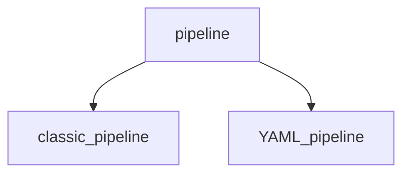

# Notes for pipeline



## Classic Pipeline
- classic pipeline are configured using a graphical user interface by selecting options from the provided choices. This applies to both build and release pipelines.

## YAML Pipeline
- YAML pipeline are configured using code in a YAML file
- Human friendly data serialization standard
- YAML.org
- It's widely used for Docker files, Kubernetes templates, Ansible configurations ...

## YAML basic syntax
- Key value pair
```keyword: value```
- Comment
```# some comments```
- Objects
```
microservices:
- app: user-service
  port:8080
  version: 1.7
- app: address-service
  port:8789
  version: 1.1
```
- Strings
```
location: westeurope
acccountname: 'accountant'
scriptlocation: "inlineScript"
testcontent: |
    First line
    second line
    third line
```
- Variables
```
variables:
- name: AzureSubscription
 value: '$(ServiceConnection)' #this value is not know at the moment, but soon as you run the pipeline, it will get the replace this parameter with the value which was configured for the pipeline
```
## Some key words
- trigger
```
  trigger:
  - main
  # it says it will triggered by main branch
  # whenever you do any changes to your main branch,
  # this pipeline will be triggered automatically
```
- pool
```
pool:
    vmImage: ubuntu-latest
# which we define on which type of server we going to run our pipeline
# It's a completely isolated server which is completely under control of Microsoft.
```
- steps
```
# which you define the steps you want to run in your pipeline
- steps:
- script: echo Hello, world!
  displayName: 'Run a one line script' # the name that you can see when you run the pipeline

- script: | #<- You indicate that your script has a multiple lines, which you can define multiple scripts in one go 
        echo Add other to build, test, and deploy your project.
        echo See http://aka.ms/yaml
    displayName: 'Run a multi-line script'
```
