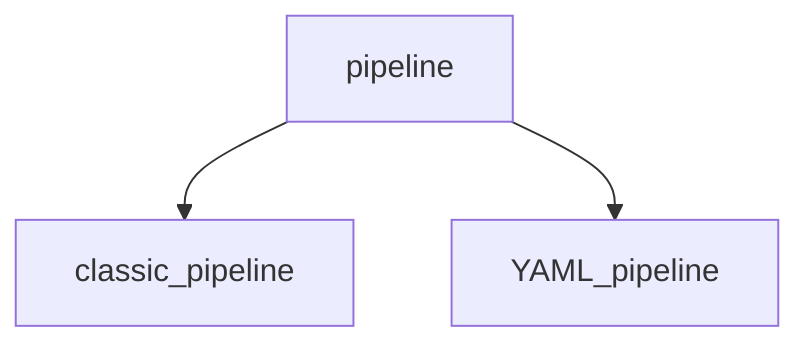

# Notes for pipeline



## Classic Pipeline
- classic pipeline are configured using a graphical user interface by selecting options from the provided choices. This applies to both build and release pipelines.

## YAML Pipeline
- YAML pipeline are configured using code in a YAML file
- Human friendly data serialization standard
- YAML.org
- It's widely used for Docker files, Kubernetes templates, Ansible configurations ...

## YAML basic syntax
- Key value pair
```keyword: value```
- Comment
```# some comments```
- Objects
```
microservices:
- app: user-service
  port:8080
  version: 1.7
- app: address-service
  port:8789
  version: 1.1
```
- Strings
```
location: westeurope
acccountname: 'accountant'
scriptlocation: "inlineScript"
testcontent: |
    First line
    second line
    third line
```
- Variables
```
variables:
- name: AzureSubscription
 value: '$(ServiceConnection)' #this value is not know at the moment, but soon as you run the pipeline, it will get the replace this parameter with the value which was configured for the pipeline
```

